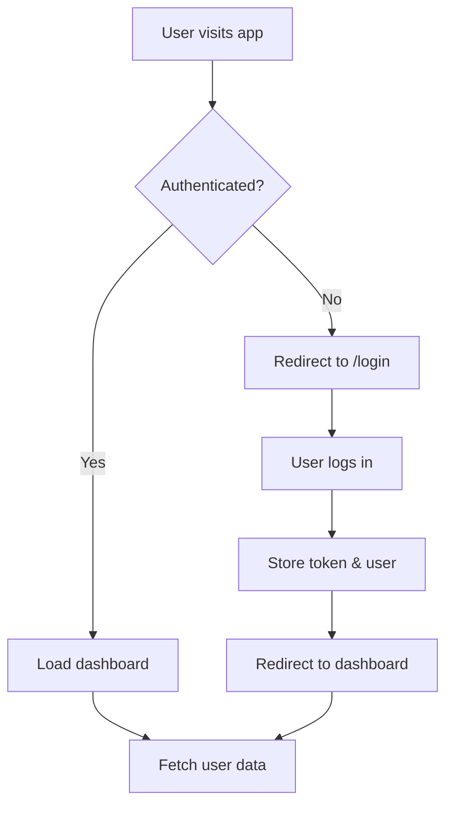

# Architecture Documentation

## 🏗️ Clean Architecture Overview

This project follows clean architecture principles with clear separation of concerns:

```
┌─────────────────────────────────────┐
│         Presentation Layer          │
│    (Pages, Layouts, Components)     │
└─────────────────────────────────────┘
                  ↓
┌─────────────────────────────────────┐
│        Application Layer            │
│    (Stores, Composables, Utils)     │
└─────────────────────────────────────┘
                  ↓
┌─────────────────────────────────────┐
│          Domain Layer               │
│         (Types, Models)             │
└─────────────────────────────────────┘
                  ↓
┌─────────────────────────────────────┐
│      Infrastructure Layer           │
│       (API, External Services)      │
└─────────────────────────────────────┘
```

## 📂 Directory Structure Explained

### `/components` - Reusable UI Components
**Purpose:** Presentational components that are reusable across pages

**Examples:**
- `ThemeToggle.vue` - Dark mode switcher
- `StatCard.vue` - Dashboard statistics card
- `DashboardChart.vue` - Chart wrapper component

**Rules:**
- Should be pure and reusable
- Accept props for configuration
- Emit events for parent communication
- No direct API calls (use composables)

### `/composables` - Reusable Logic
**Purpose:** Business logic and utilities that can be reused

**Examples:**
- `useApi.ts` - Axios wrapper with authentication
- `useToast.ts` - Notification system

**Rules:**
- Export functions that return reactive state/methods
- Can access stores
- Should be framework-agnostic where possible
- Use TypeScript for type safety

### `/layouts` - Page Layouts
**Purpose:** Define the structure that wraps around pages

**Examples:**
- `default.vue` - Main layout with sidebar and topbar

**Rules:**
- Use `<slot />` for page content
- Handle global UI elements (sidebar, navbar, footer)
- Manage layout state (sidebar open/close)

### `/middleware` - Route Guards
**Purpose:** Execute logic before route navigation

**Examples:**
- `auth.global.ts` - Authentication check

**Rules:**
- Global middleware (`.global.ts`) runs on every route
- Can redirect users
- Should be lightweight
- Return `navigateTo()` for redirects

### `/pages` - Application Routes
**Purpose:** Define application routes (Nuxt auto-routing)

**Examples:**
- `index.vue` → `/`
- `login.vue` → `/login`
- `users.vue` → `/users`

**Rules:**
- File name becomes the route
- Use `definePageMeta()` for page-specific config
- Can define layouts, middleware, transitions

### `/stores` - State Management
**Purpose:** Global state management using Pinia

**Examples:**
- `auth.ts` - User authentication state
- `theme.ts` - Dark mode state
- `dashboard.ts` - Dashboard data

**Structure:**
```typescript
export const useXStore = defineStore('x', {
  state: () => ({ /* ... */ }),
  getters: { /* ... */ },
  actions: { /* async functions */ }
})
```

**Rules:**
- One store per domain/feature
- Use actions for async operations
- Getters for computed values
- State should be serializable

### `/types` - TypeScript Definitions
**Purpose:** Shared type definitions

**Examples:**
- `User`, `AuthState`, `ApiResponse`

**Rules:**
- Use interfaces for objects
- Use types for unions/primitives
- Export all types for reuse
- Keep types close to usage when possible

## 🔄 Data Flow

### 1. User Interaction
```
User clicks button → Component emits event
```

### 2. Component Logic
```
Component → Calls store action or composable
```

### 3. State Update
```
Store action → Calls API via composable → Updates state
```

### 4. UI Update
```
Reactive state → Auto-updates component → DOM renders
```

## 🔐 Authentication Flow



**Implementation:**
1. `middleware/auth.global.ts` checks authentication
2. `stores/auth.ts` manages auth state
3. `composables/useApi.ts` injects auth token
4. `pages/login.vue` handles login UI

## 🎨 Styling Architecture

### Tailwind CSS Strategy

**1. Utility-First**
```vue
<div class="bg-white dark:bg-gray-800 rounded-lg p-6">
```

**2. Component Classes**
```css
@layer components {
  .btn-primary {
    @apply bg-primary-600 text-white px-4 py-2 rounded-lg;
  }
}
```

**3. Dark Mode**
```vue
<div class="text-gray-900 dark:text-gray-100">
```

### Color System
- **Primary:** Brand color (blue)
- **Gray:** UI backgrounds and text
- **Semantic:** success (green), warning (yellow), danger (red)

## 📊 Chart Integration

### Using Chart.js

**Component Wrapper:**
```vue
<DashboardChart
  title="Revenue"
  :data="chartData"
  type="line"
/>
```

**Data Structure:**
```typescript
const chartData = {
  labels: ['Jan', 'Feb', 'Mar'],
  datasets: [{
    label: 'Revenue',
    data: [100, 200, 150]
  }]
}
```

**Theme Integration:**
- Charts respond to dark mode
- Colors from Tailwind config
- Automatic updates on theme change

## 🔧 Configuration Management

### Environment Variables
```typescript
// nuxt.config.ts
runtimeConfig: {
  apiSecret: process.env.API_SECRET,
  public: {
    apiBase: process.env.API_BASE_URL
  }
}
```

### Usage
```typescript
const config = useRuntimeConfig()
console.log(config.public.apiBase)
```

## 🚀 Performance Considerations

### Code Splitting
- Automatic route-based splitting
- Lazy-load heavy components
- Tree-shaking unused code

### State Management
- Local state for component-specific data
- Pinia stores for global state
- Avoid over-fetching

### Styling
- Tailwind JIT for minimal CSS
- PurgeCSS removes unused styles
- Dark mode without JavaScript flash

## 🧪 Testing Strategy (To Implement)

### Unit Tests
- Components with Vitest
- Stores with Pinia Testing
- Composables with Vue Test Utils

### E2E Tests
- Playwright or Cypress
- Critical user flows
- Authentication flows

### Type Safety
- TypeScript for compile-time checks
- ESLint for code quality
- Prettier for formatting

## 📦 Build & Deployment

### Development
```bash
npm run dev  # Local development with HMR
```

### Production
```bash
npm run build    # Build for production
npm run preview  # Preview production build
```

### Static Generation
```bash
npm run generate  # Generate static site
```

## 🔄 State Persistence

### LocalStorage Strategy
- Auth token → `localStorage.setItem('auth_token')`
- User data → `localStorage.setItem('user')`
- Theme → `localStorage.setItem('theme')`

### Hydration
- Check localStorage on app mount
- Restore state from storage
- Validate and refresh if needed

## 🎯 Best Practices

### Component Design
✅ Single Responsibility Principle
✅ Props down, events up
✅ Composition over inheritance
✅ Keep components small (<300 lines)

### State Management
✅ One source of truth
✅ Immutable updates
✅ Async in actions only
✅ Getters for computed values

### TypeScript
✅ Strict mode enabled
✅ No `any` types
✅ Interface for objects
✅ Export all types

### Styling
✅ Mobile-first responsive
✅ Dark mode for all components
✅ Consistent spacing scale
✅ Reusable utility classes

## 🔍 Debugging Tips

### Vue DevTools
- Install browser extension
- Inspect component tree
- View Pinia stores
- Track events

### Nuxt DevTools
- Press `Shift + Alt + D`
- View routes and modules
- Inspect server routes
- Check payload

### Console Logging
```typescript
// Development only
if (process.dev) {
  console.log('Debug:', data)
}
```

## 📚 Further Reading

- [Nuxt 3 Docs](https://nuxt.com)
- [Vue 3 Docs](https://vuejs.org)
- [Pinia Docs](https://pinia.vuejs.org)
- [Tailwind CSS Docs](https://tailwindcss.com)
- [Chart.js Docs](https://chartjs.org)

---

This architecture provides a solid foundation for building scalable, maintainable Nuxt 3 applications. Adapt and extend as your needs grow!

